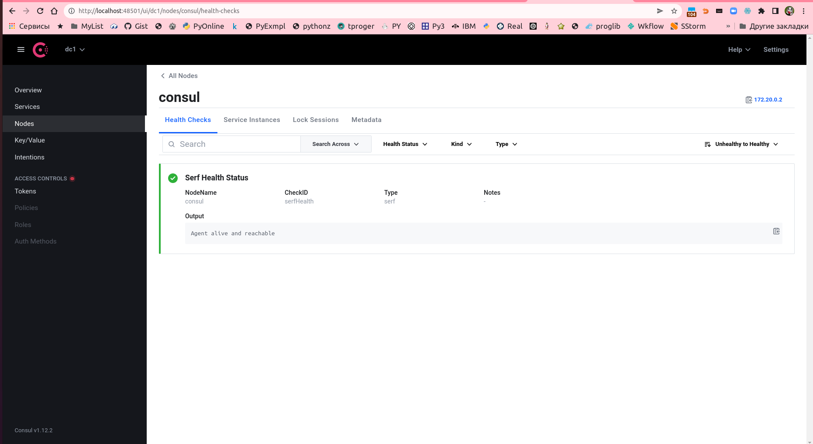
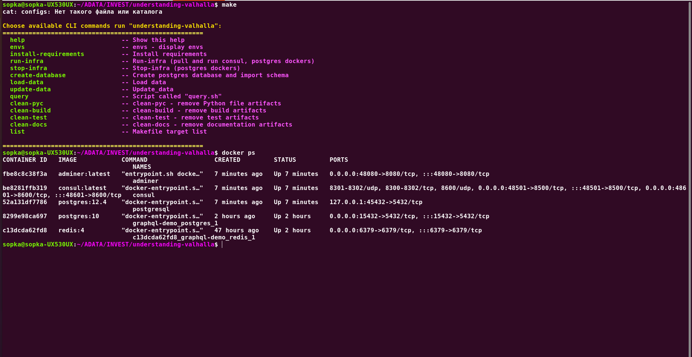
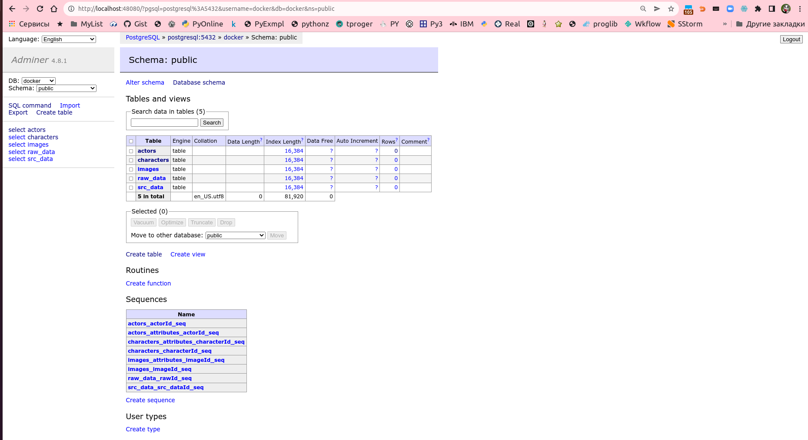
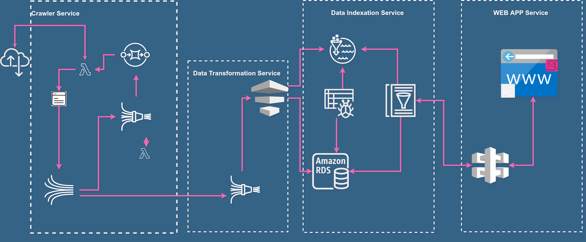

# understanding-valhalla
Scraping, Store data, Web App, Git repository

Crawlers
=============
A web crawler that, visits HTML pages within the same domain for a given url.
The scraper should start scraping from the initial url, find all the links inside the page & continue scraping them recursively (until reaching the max depth).
The scraper should save it results to a db each result should contain:
.........

Why asyncio?
------------
Python finally has an excellent asynchronous framework, asyncio. Lets take a look at all the problems of threading and see if we have solved them.
1) **CPU Context switching:** asyncio is asynchronous and uses an event loop; it allows you to have application controlled context switches while waiting for I/O. No CPU switching found here!
2) **Race Conditions:** Because asyncio only runs a single coroutine at a time and switches only at points you define, your code is safe from race conditions.
3) **Dead-Locks/Live-Locks:** Since you don’t have to worry about race conditions, you don’t have to use locks at all. This makes you pretty safe from dead-locks. You could still get into a dead-lock situation if you require two coroutines to wake each other, but that is so rare you would almost have to try to make it happen.
4) **Resource Starvation:** Because coroutines are all run on a single thread, and dont require extra sockets or memory, it would be a lot harder to run out of resources. Asyncio however does have an “executor pool” which is essentially a thread pool. If you were to run too many things in an executor pool, you could still run out of resources. However, using too many executors is an anti-pattern, and not something you would probably do very often.

# Done: Infraction and Scrapers, Dockers:

===========================================================
# !!!!!! Not to Use !!!!! 

